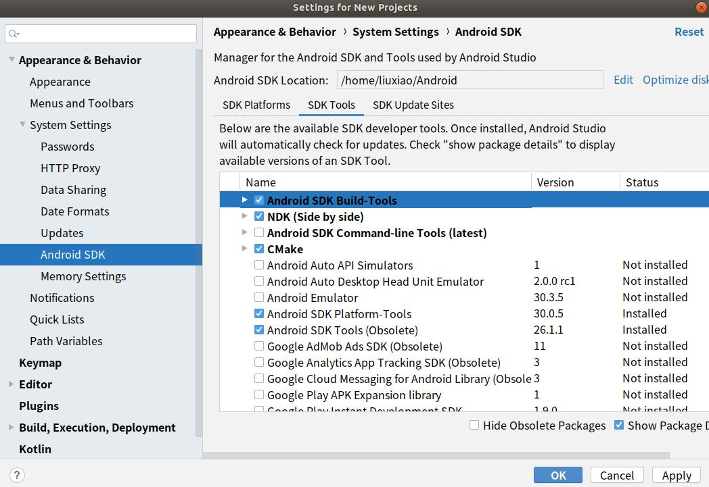
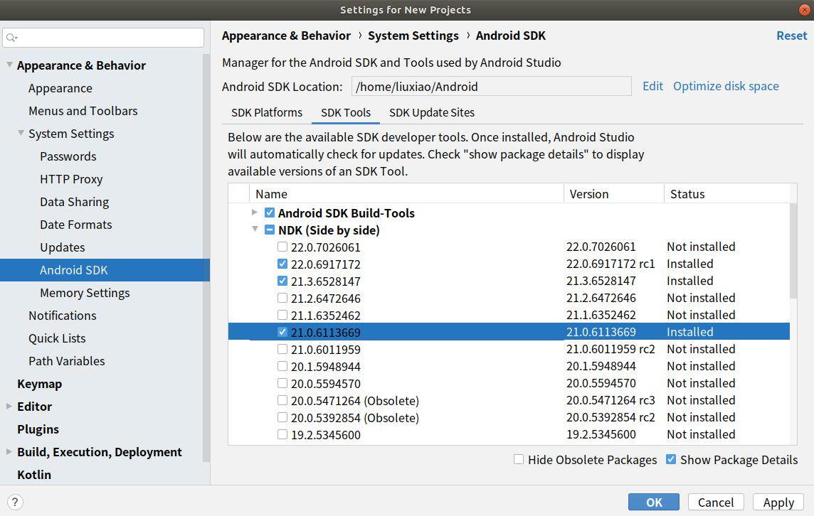

# MindSpore Lite 端侧场景检测demo（Android）

本示例程序演示了如何在端侧利用MindSpore Lite C++ API（Android JNI）以及MindSpore Lite 场景检测模型完成端侧推理，对设备摄像头捕获的内容进行检测，并在App图像预览界面中显示连续目标检测结果。

## 运行依赖

- Android Studio >= 3.2 (推荐4.0以上版本)

## 构建与运行

1. 在Android Studio中加载本示例源码。

    

    启动Android Studio后，点击`File->Settings->System Settings->Android SDK`，勾选相应的`SDK Tools`。如下图所示，勾选后，点击`OK`，Android Studio即可自动安装SDK。

    

    > Android SDK Tools为默认安装项，取消`Hide Obsolete Packages`选框之后可看到。
    >
    > 使用过程中若出现问题，可参考第4项解决。

2. 连接Android设备，运行该应用程序。

    通过USB连接Android手机。待成功识别到设备后，点击`Run 'app'`即可在您的手机上运行本示例项目。

    > 编译过程中Android Studio会自动下载MindSpore Lite、模型文件等相关依赖项，编译过程需做耐心等待。
    >
    > Android Studio连接设备调试操作，可参考<https://developer.android.com/studio/run/device?hl=zh-cn>。
    >
    > 手机需开启“USB调试模式”，Android Studio 才能识别到手机。 华为手机一般在设置->系统和更新->开发人员选项->USB调试中开始“USB调试模型”。

    

3. 在Android设备上，点击“继续安装”，安装完即可查看到设备摄像头捕获的内容和推理结果。

    

    如下图所示，识别出的概率最高的物体是植物。

    

4. Demo部署问题解决方案。

    4.1 NDK、CMake、JDK等工具问题：

    如果Android Studio内安装的工具出现无法识别等问题，可重新从相应官网下载和安装，并配置路径。

    - NDK >= 21.3 [NDK](https://developer.android.google.cn/ndk/downloads?hl=zh-cn)
    - CMake >= 3.10.2   [CMake](https://cmake.org/download)
    - Android SDK >= 26 [SDK](https://developer.microsoft.com/zh-cn/windows/downloads/windows-10-sdk/)
    - JDK >= 1.8 [JDK](https://www.oracle.com/cn/java/technologies/javase/javase-jdk8-downloads.html)

        

    4.2 NDK版本不匹配问题：

    打开`Android SDK`，点击`Show Package Details`，根据报错信息选择安装合适的NDK版本。
    

    4.3 Android Studio版本问题：

    在`工具栏-help-Checkout for Updates`中更新Android Studio版本。

    4.4 Gradle下依赖项安装过慢问题：

   如图所示， 打开Demo根目录下`build.gradle`文件，加入华为镜像源地址：`maven {url 'https://developer.huawei.com/repo/'}`，修改classpath为4.0.0，点击`sync`进行同步。下载完成后，将classpath版本复原，再次进行同步。
    

## 示例程序详细说明  

### 示例程序结构

```text
app
|
├── libs # 存放demo jni层编译出的库文件
│   └── arm64-v8a
│       │── libmlkit-label-MS.so #
|
├── src/main
│   ├── assets # 资源文件
|   |   └── mobilenetv2.ms # 存放模型文件
│   |
│   ├── cpp # 模型加载和预测主要逻辑封装类
|   |   ├── mindspore-lite-x.x.x-mindata-arm64-cpu # minspore源码编译出的调用包,包含demo jni层依赖的库文件及相关的头文件
|   |   |   └── ...
│   |   |
|   |   ├── MindSporeNetnative.cpp # MindSpore调用相关的JNI方法
│   ├── java # java层应用代码
│   │   └── com.huawei.himindsporedemo
│   │       ├── help # 图像处理及MindSpore JNI调用相关实现
│   │       │   └── ...
│   │       └── obejctdetect # 开启摄像头及绘制相关实现
│   │           └── ...
│   │
│   ├── res # 存放Android相关的资源文件
│   └── AndroidManifest.xml # Android配置文件
│
├── CMakeLists.txt # cmake编译入口文件
│
├── build.gradle # 其他Android配置文件
├── download.gradle # APP构建时由gradle自动从HuaWei Server下载依赖的库文件及模型文件
└── ...
```

### 配置MindSpore Lite依赖项

Android JNI层调用MindSpore C++ API时，需要相关库文件支持。可通过MindSpore Lite[源码编译](https://www.mindspore.cn/tutorial/lite/zh-CN/master/use/build.html)生成`mindspore-lite-{version}-minddata-{os}-{device}.tar.gz`库文件包并解压缩（包含`libmindspore-lite.so`库文件和相关头文件），在本例中需使用生成带图像预处理模块的编译命令。

> version：输出件版本号，与所编译的分支代码对应的版本一致。
>
> device：当前分为cpu（内置CPU算子）和gpu（内置CPU和GPU算子）。
>
> os：输出件应部署的操作系统。

本示例中，build过程由download.gradle文件自动下载MindSpore Lite 版本文件，并放置在`app/src/main/cpp/`目录下。

> 若自动下载失败，请手动下载相关库文件，解压并放在对应位置：

  mindspore-lite-1.0.1-runtime-arm64-cpu.tar.gz [下载链接](https://ms-release.obs.cn-north-4.myhuaweicloud.com/1.0.1/lite/android_aarch64/mindspore-lite-1.0.1-runtime-arm64-cpu.tar.gz)

在app的`build.gradle`文件中配置CMake编译支持，以及`arm64-v8a`的编译支持，如下所示：

```text
android{
    defaultConfig{
        externalNativeBuild{
            cmake{
                arguments "-DANDROID_STL=c++_shared"
            }
        }

        ndk{
            abiFilters 'arm64-v8a'
        }
    }
}
```

在`app/CMakeLists.txt`文件中建立`.so`库文件链接，如下所示。

```text
# Set MindSpore Lite Dependencies.
set(MINDSPORELITE_VERSION  mindspore-lite-1.0.1-runtime-arm64-cpu)
include_directories(${CMAKE_SOURCE_DIR}/src/main/cpp/${MINDSPORELITE_VERSION})
add_library(mindspore-lite SHARED IMPORTED )
add_library(minddata-lite SHARED IMPORTED )
set_target_properties(mindspore-lite PROPERTIES IMPORTED_LOCATION
        ${CMAKE_SOURCE_DIR}/src/main/cpp/${MINDSPORELITE_VERSION}/lib/libmindspore-lite.so)
set_target_properties(minddata-lite PROPERTIES IMPORTED_LOCATION
        ${CMAKE_SOURCE_DIR}/src/main/cpp/${MINDSPORELITE_VERSION}/lib/libminddata-lite.so)

# Link target library.
target_link_libraries(
    ...
    mindspore-lite
    minddata-lite
    ...
)
```

### 下载及部署模型文件

从MindSpore Model Hub中下载模型文件，本示例程序中使用的场景检测模型文件为`mobilenetv2.ms`，同样通过`download.gradle`脚本在APP构建时自动下载，并放置在`app/src/main/assets`工程目录下。

> 若下载失败请手动下载模型文件，mobilenetv2.ms [下载链接](https://download.mindspore.cn/model_zoo/official/lite/mobilenetv2_openimage_lite/mobilenetv2.ms)。

### 编写端侧推理代码

在JNI层调用MindSpore Lite C++ API实现端测推理。

推理代码流程如下，完整代码请参见`src/cpp/MindSporeNetnative.cpp`。

1. 加载MindSpore Lite模型文件，构建上下文、会话以及用于推理的计算图。  

    - 加载模型文件

        ```cpp
        jlong bufferLen = env->GetDirectBufferCapacity(model_buffer);
        if (0 == bufferLen) {
            MS_PRINT("error, bufferLen is 0!");
            return (jlong) nullptr;
        }

        char *modelBuffer = CreateLocalModelBuffer(env, model_buffer);
        if (modelBuffer == nullptr) {
            MS_PRINT("modelBuffer create failed!");
            return (jlong) nullptr;
        }
        ```

    - 创建会话

        ```cpp
        void **labelEnv = new void *;
        MSNetWork *labelNet = new MSNetWork;
        *labelEnv = labelNet;

        mindspore::lite::Context *context = new mindspore::lite::Context;
        context->thread_num_ = num_thread;
        context->device_list_[0].device_info_.cpu_device_info_.cpu_bind_mode_ = mindspore::lite::NO_BIND;
        context->device_list_[0].device_info_.cpu_device_info_.enable_float16_ = false;
        context->device_list_[0].device_type_ = mindspore::lite::DT_CPU;

        labelNet->CreateSessionMS(modelBuffer, bufferLen, context);
        delete context;
        ```

    - 加载模型文件并构建用于推理的计算图

        ```cpp
        void
        MSNetWork::CreateSessionMS(char *modelBuffer, size_t bufferLen, mindspore::lite::Context *ctx) {
            session_ = mindspore::session::LiteSession::CreateSession(ctx);
            if (session_ == nullptr) {
                MS_PRINT("Create Session failed.");
                return;
            }

            // Compile model.
            model_ = mindspore::lite::Model::Import(modelBuffer, bufferLen);
            if (model_ == nullptr) {
                ReleaseNets();
                MS_PRINT("Import model failed.");
                return;
            }

            int ret = session_->CompileGraph(model_);
            if (ret != mindspore::lite::RET_OK) {
                ReleaseNets();
                MS_PRINT("CompileGraph failed.");
                return;
            }
        }
        ```

2. 将输入图片转换为传入MindSpore模型的Tensor格式。

    ```cpp
    // Convert the Bitmap image passed in from the JAVA layer to Mat for OpenCV processing
        LiteMat lite_mat_bgr,lite_norm_mat_cut;

       if (!BitmapToLiteMat(env, srcBitmap, lite_mat_bgr)){
        MS_PRINT("BitmapToLiteMat error");
           return NULL;
       }
       int srcImageWidth = lite_mat_bgr.width_;
       int srcImageHeight = lite_mat_bgr.height_;
       if(!PreProcessImageData(lite_mat_bgr, lite_norm_mat_cut)){
        MS_PRINT("PreProcessImageData error");
           return NULL;
       }
       ImgDims inputDims;
       inputDims.channel =lite_norm_mat_cut.channel_;
       inputDims.width = lite_norm_mat_cut.width_;
       inputDims.height = lite_norm_mat_cut.height_;

       // Get the mindsore inference environment which created in loadModel().
       void **labelEnv = reinterpret_cast<void **>(netEnv);
       if (labelEnv == nullptr) {
           MS_PRINT("MindSpore error, labelEnv is a nullptr.");
           return NULL;
       }
       MSNetWork *labelNet = static_cast<MSNetWork *>(*labelEnv);

       auto mSession = labelNet->session;
       if (mSession == nullptr) {
           MS_PRINT("MindSpore error, Session is a nullptr.");
           return NULL;
       }
       MS_PRINT("MindSpore get session.");

       auto msInputs = mSession->GetInputs();
       auto inTensor = msInputs.front();

       float *dataHWC = reinterpret_cast<float *>(lite_norm_mat_cut.data_ptr_);
       // copy input Tensor
       memcpy(inTensor->MutableData(), dataHWC,
              inputDims.channel * inputDims.width * inputDims.height * sizeof(float));
       delete[] (dataHWC);
   ```

3. 对输入Tensor按照模型进行推理，获取输出Tensor。

   - 图执行，端测推理。

        ```cpp
        // After the model and image tensor data is loaded, run inference.
        auto status = mSession->RunGraph();

        if (status != mindspore::lite::RET_OK) {
            MS_PRINT("MindSpore run net error.");
            return NULL;
        }
        ```

   - 获取输出数据。

        ```cpp
        /**
         * Get the mindspore inference results.
         * Return the map of output node name and MindSpore Lite MSTensor.
         */
        auto names = mSession->GetOutputTensorNames();
        std::unordered_map<std::string, mindspore::tensor::MSTensor *> msOutputs;
        for (const auto &name : names) {
            auto temp_dat = mSession->GetOutputByTensorName(name);
            msOutputs.insert(std::pair<std::string, mindspore::tensor::MSTensor *>{name, temp_dat});
        }
        ```
